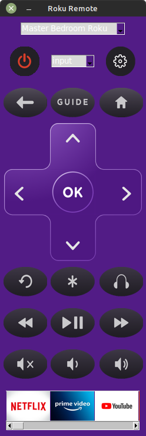

# roku
### Description
roku is a GUI application that is a remote control for Roku devices.

roku is written in Python.

### About
The application uses [SSDP](https://en.wikipedia.org/wiki/Simple_Service_Discovery_Protocol) and [RokuECP](https://developer.roku.com/docs/developer-program/debugging/external-control-api.md)
to discover and control Roku devices on the network and displays a user-interface resembling a remote control.
This allows you to select the device to control, and click the various buttons to send commands to the roku device,
navigate the on-screen menus, select channels etc.

```
Usage: roku <options>

Options:
  --log-level [debug|info|error]  Log level (default: debug)
  --timeout INTEGER               length of time in seconds to keep listening
                                  for devices, default 60s
  -h, --help                      Show this message and exit.


Also part of the package is a utility called discover that performs network discovery of all
devices that respond to the SSDP request.

Usage: discover
```
The application gui will start in "discovering ..." mode:


After a period of time, network and device dependent, a list of Roku devices will appear.
The power button dynamically reflects the current power state of the Roku device:




To build the application:
```
python -m build
```
To install/reinstall the wheel:
```
pip install dist/*.whl [--force-reinstall]
```
or to install as editable
```
pip install -e .
```
