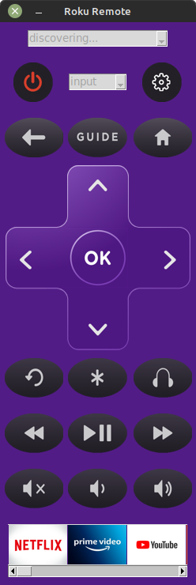

# roku
### Description
roku is a GUI application that is a remote control for Roku devices.

roku is written in Python.

### About
The application uses [SSDP](https://en.wikipedia.org/wiki/Simple_Service_Discovery_Protocol) and [RokuECP](https://developer.roku.com/docs/developer-program/debugging/external-control-api.md)
to discover and control Roku devices on the network and displays a user-interface resembling a remote control.
This allows you to:
* select the device to control
* select the video input
* navigate the on-screen user-interface
* click the various buttons to send commands to the roku
* use the keyboard to send keystrokes in search boxes

```
Usage: roku <options>

Options:
  --log-level [debug|info|error]  Log level (default: debug)
  --timeout INTEGER               length of time in seconds to keep listening
                                  for devices, default 60s
  -h, --help                      Show this message and exit.


Also part of the package is a utility called discover that performs network discovery of all
devices that respond to the SSDP request.

Usage: discover
```
The application gui will start in "discovering ..." mode. 
After a period of time, network and device dependent, a list of Roku devices will appear.
The power button dynamically reflects the current power state of the Roku device.




To build the application:
```
python -m build
```
To install/reinstall the wheel:
```
pip install dist/*.whl [--force-reinstall]
```
or to install as editable
```
pip install -e .
```

# Keyboard Guide
The user interface has keyboard support, so you can type in search fields etc. Other keys with functions are:
| Keyboard Key 	| Roku Function 	|
|--------------	|---------------	|
| Backspace    	| Backspace     	|
| Delete       	| Backspace     	|
| Cursor Up    	| Up            	|
| Cursor Down  	| Down          	|
| Cursor Right 	| Right         	|
| Cursor Left  	| Left          	|
| Pause        	| Play/Pause    	|
| Home         	| Home/Back     	|
| Escape       	| Home/Back     	|
| Return       	| Select        	|

# Channel Ribbon
The channel ribbon contains images for each known channel. To select a channel to be displayed on the Roku, select it by clickig the mouse. The ribbon scrolls horizontally. I determined these by brute force requesting from my roku devices using a bash script:
~~~
#!/bin/bash
for i in {0..1000000}
do
    wget -q http://<ipaddress>:8060/query/icon/$i -O chan$i.jpeg
    if [ $(expr $i % 1000) == "0" ]
    then
        echo $i
        find . -size 0 -exec rm {} \;
    fi
done
~~~
Here's a table of all the channel ids I know:
| Channel ID 	| Name    | Image  |
|------------	| ------  | ------ |
| 12          | Netflix |  |
| 13          | Prime Video | |
| 837         | YouTube | |
| 2016          | Crackle | |
| 2285          | Hulu | |
| 14362          | Amazon Music | |
| 15985          | Play on Roku | |
| 19977          | Spotify | |
| 22297          | Spotify (again) | |
| 23353          | PBS | |
| 27536          | CBS News | |
| 31012          | Roku Vudu Store | |
| 31440          | Paramount + | |
| 34376          | ESPN | |
| 43465          | fuboTV | |
| 43508          | fuboTV (again) | |
| 43735          | unknown | |
| 54383          | DFP Ads | |
| 55545          | unknown | |
| 58484          | unknown | |
| 61322          | HBOmax | |
| 62675          | WCNC+ | |
| 72916          | GO! | |
| 74519          | pluto(tv) | |
| 83669          | NCAA March Madness Live | |
| 98832          | Roku Developers | |
| 109022          | unknown | |
| 122409          | kanopy | |
| 130644          | KARTOON channel! | |
| 151908          | Roku Channel | |
| 154157          | TNT | |
| 155883          | My Channel | |
| 173735          | Ecosystem | |
| 194485          | Survey Channel | |
| 250045          | My Channel (again) | |
| 260537          | Google Interactice Media Ads | |
| 262399          | unknown (chromium?) | |
| 265831          | Olympic Channel | |
| 272343          | My Channel (again) | |
| 278897          | unknown | |
| 291097          | Disney+ | |
| 291685          | Streaming Cities | |
| 295059          | Roku Developers (again) | |
| 551012          | AppleTV | |
| 557456          | CobaltLib | |
| 562859          | My Channel (again) | |
| 586995          | Airplay | |
| 594971          | My Channel (again) | |
| 596080          | Roku Developers (again) | |
| 596759          | TCL Channel Movies, Cartoons & TV | |
| 600835          | unknown | |
| 611444          | RUM | |
| 611688          | Roku NetPing | |
| 615685          | freevee | |
| 631123          | Happy Summer | |
| 631467          | CLoud SDK | |
| 633458          | Voice Help | |
| 639619          | My Channel (again) | |
| 659410          | Launcher | |
| 680626          | Dynamic | |
 
